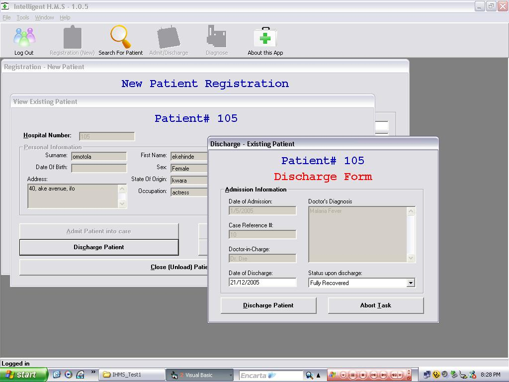



## Intelligent Hospital Management System

### Description

Hospital Management System mainains a DB of patients registered with a hospital. New patients can be REGISTERED, existing patients can be ADMITTED or DISCHARGED, based on their current status, a hospital history of each patient is maintained, showing the kinds of illnesses they've been admitted for in the hospital. Am currently working on the best part of this Application: the part that helps diagnose patients illness based on the symptoms reported and entered into the systme by the doctor.
 
### More Info
 
1. Symptoms reported by patient

2. Records in the DB

Diagnosis results

none... if u spot any,holla at me

             |
---                |---
**Submitted On**   |2006-02-03 20:29:18
**By**             |['seyi Ogunbanjo](https://github.com/Planet-Source-Code/PSCIndex/blob/master/ByAuthor/seyi-ogunbanjo.md)
**Level**          |Advanced
**User Rating**    |5.0 (30 globes from 6 users)
**Compatibility**  |VB 6\.0, VBA MS Access
**Category**       |[Complete Applications](https://github.com/Planet-Source-Code/PSCIndex/blob/master/ByCategory/complete-applications__1-27.md)
**World**          |[Visual Basic](https://github.com/Planet-Source-Code/PSCIndex/blob/master/ByWorld/visual-basic.md)
**Archive File**   |[Intelligen196974232006\.zip](https://github.com/Planet-Source-Code/seyi-ogunbanjo-intelligent-hospital-management-system__1-63862/archive/master.zip)

